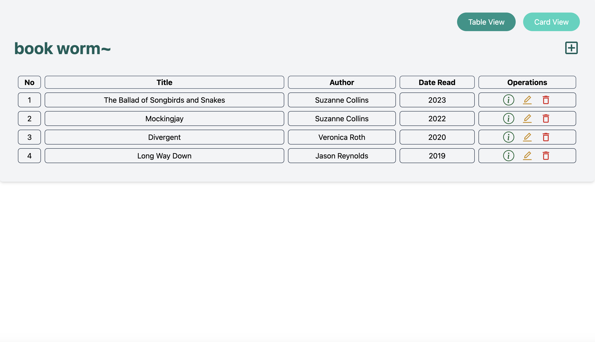
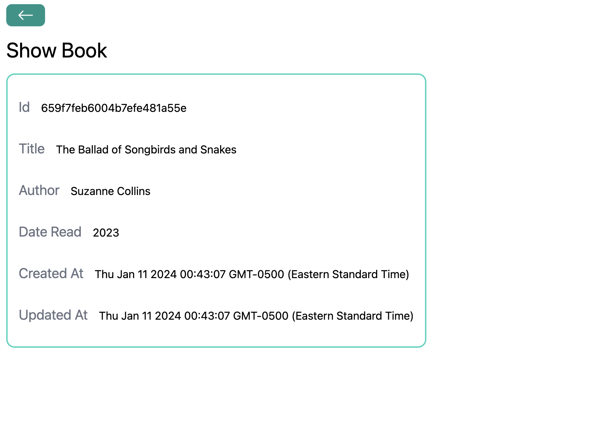
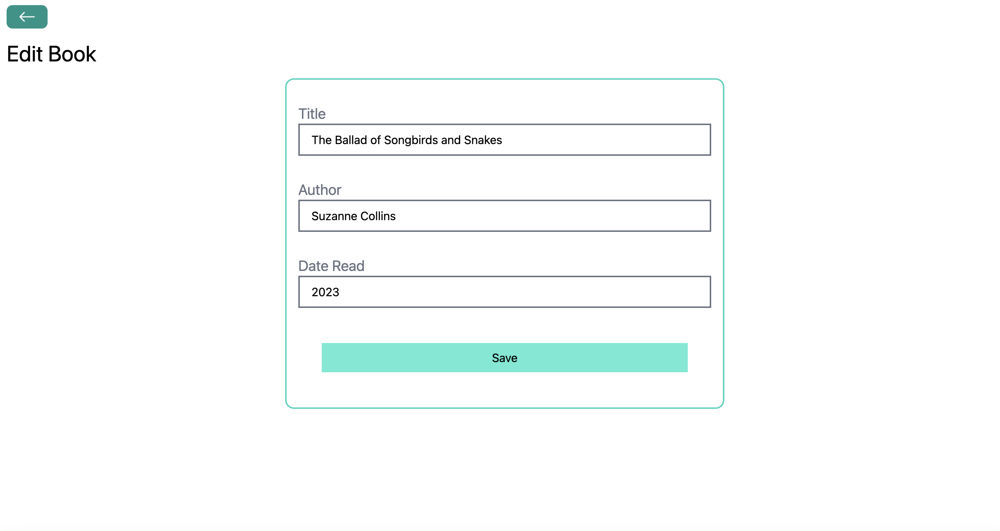
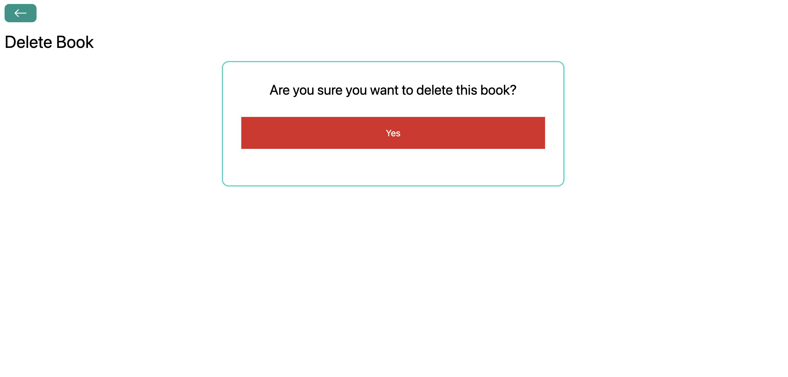
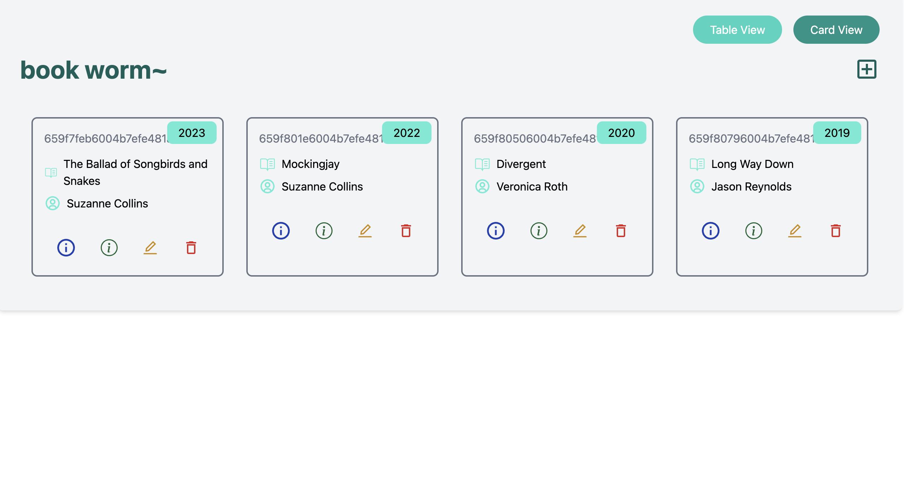

# Book Worm

Book Worm is a React application for managing a personal library of books.

## Features

- View all books in a table or card view.
- Add new books to the library.
- View detailed information about each book.
- Delete books from the library.

## Screenshots
 

## Installation

1. Clone the repository:
git clone git@github.com:syousafz/book-worm.git

2. Navigate into the project directory:

cd book-worm

3. Install the dependencies:

npm install

4. Start the development server:

npm start

## Usage

Navigate to `http://localhost:5173` in your web browser to view the application.
